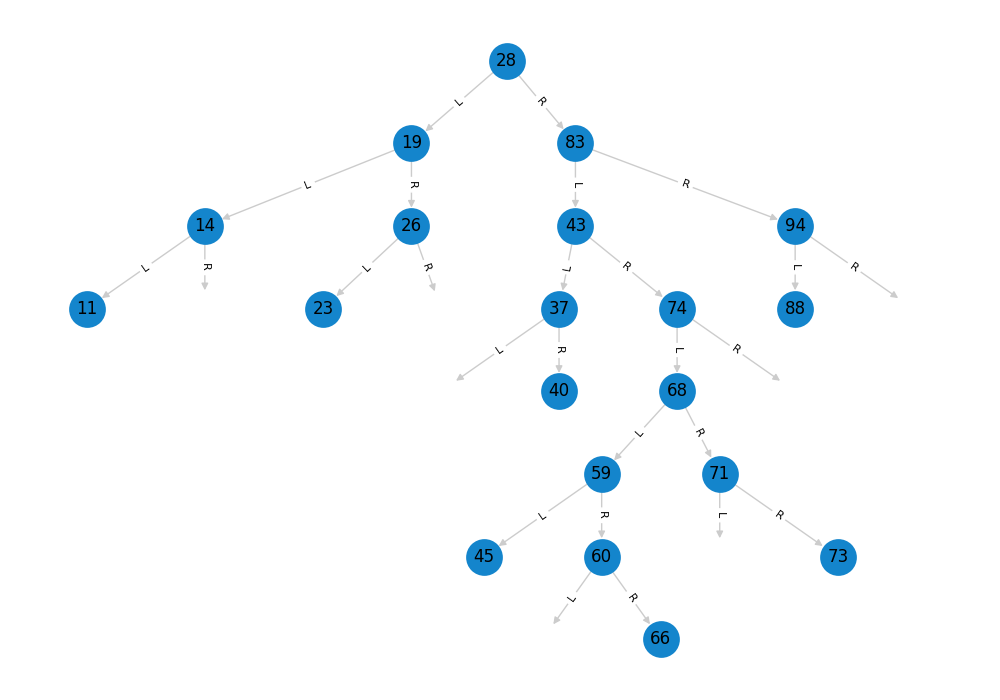
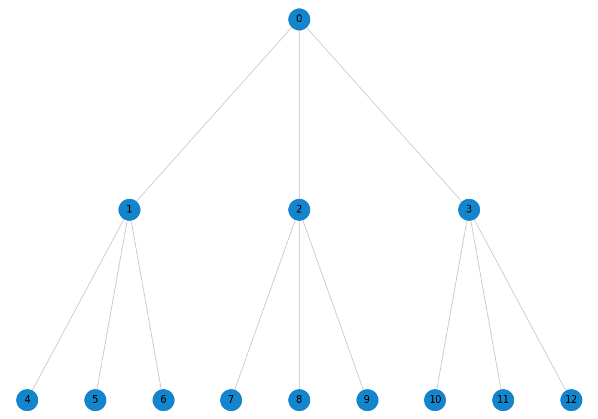

# show-tree

Some functions to show tree graphs. 
Can be used both in standalone programs and in `jupyther` nonebooks. 

Preconditions
-------------
The folowing libraries should be installed
`matplotlib, networkx, graphviz, pygraphviz`

Please use conda or pip.

Usage
-----
```python
from showtree import show_binary_tree, show_tree_graph
```


show_binary_tree
-----------------


Shows a tree of nodes similar to:
```python
class Node:
    def __init__(self, val=''):
        self.data = val
        self.left = None
        self.right = None

```
The nodes on the chart will be labeled with `data` attribute.
If you want to use a different attribute change `label_attr` parameter.


### show_binary_tree(root_node, label_attr='data', file_name=None)


Parameters
----------
root_node : the root node of a tree.
    A tree graph created with NetworkX

label_attr: an attribute used for labeling nodes

file_name: if specified the picture will be saved instead of showing.


Examples
--------
```
>>> show_binary_tree(root)
```




show_tree_graph
-------------

    Shows a tree graph.

### show_tree_graph(G, file_name=None)

Parameters
----------
G : NetworkX tree graph.
    A tree graph created with NetworkX.

file_name: If specified the picture will be saved instead of showing.

Examples
--------
```
>>> gg = nx.balanced_tree(3, 2)
>>> show_tree_graph(gg)
```



